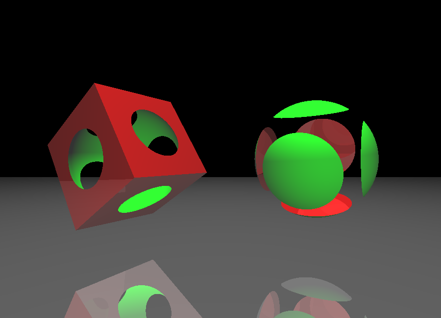

# lightly-rusted
lightly-rusted is a small raytracer that leverages a scene graph in JSON format.

lightly-rusted is written in Rust as demo project for me to learn the language. The code should be pretty easy to understand (though far from optimized) for people that want to start exploring raytracing. The main gist resides in the `intersect` function in `src/main.rs` which fires the primary ray.


<table>
  <tbody>
    <tr>
      <td>
        <a href="examples/primitives.json">Primitives</a><br>
        
      </td>
      <td>
        <a href="examples/textures.json">Texturing</a><br>
         
      </td>
    </tr>
    <tr>
      <td>
        <a href="examples/obj.json">Obj model and Refraction</a><br>
         
      </td>
      <td>
        <a href="examples/csg.json">CSG</a><br>
        
      </td>
    </tr>
  </tbody>
</table>


## Build
```
# See: target/release/lightly-rusted
cargo build --release
```


## Running lightly-rusted
This will create a `render-result.png` file.

Available options are `--workers`, `--scene`, and `--size`.

```
# Use all defaults (scene01.json, 400x300, 1 worker)
./lightly-rusted

# Custom scene only
./lightly-rusted -- --scene scene02.json

# Custom size only
./lightlh-rusted -- --size 1920x1080

# Both scene and size
./lightly-rusted -- --scene examples/primitives.json --size 800x600

# Use custom scene worker 6 worker threads
./lightly-rusted -- --scene examples/primitives.json --workers 6
```


## Development 
```
cargo run --release -- <arguments>
cargo run -- <arguments>
```


## Features
- Primitive shapes: sphere, cube, cone
- Reflection, refraction, shadows
- Hierarchical scene graph
- Model meshes (via tobj loader)
- Parallel patch rendering (via rayon)
- Texture support
- Constructive solid geometries (on primitives)


## Scene graph spec
See `schema.json` and example scene `scene01.json`.


