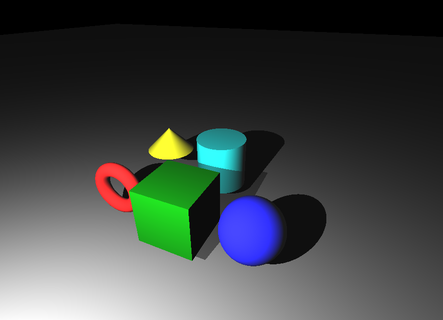
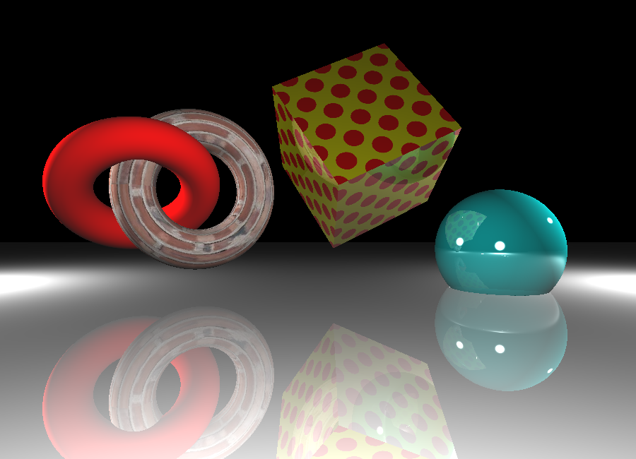

# lightly-rusted
lightly-rusted is a small raytracer that leverages a scene graph in JSON format.

lightly-rusted is written in Rust as demo project for me to learn the language. The code should be pretty easy to understand (though far from optimized) for people that want to start exploring raytracing, the main gist resides in the `intersect` function.


## Running 
This will create a `render-result.png`.

```
# Use all defaults (scene01.json)
cargo run

# Custom scene only
cargo run -- --scene scene02.json

# Custom size only
cargo run -- --size 1920x1080

# Both
cargo run -- --scene scene02.json --size 800x600
```

## Features
- Primitive shapes: sphere, cube, cone
- Reflection, refraction, shadows
- Hierarchical scene graph
- Model meshes (via tobj loader)
- Parallel patch rendering (via rayon)
- Texture support


## Scene graph spec
See `schema.json` and example scene `scene01.json`.


## Examples
Primitives



Textures


